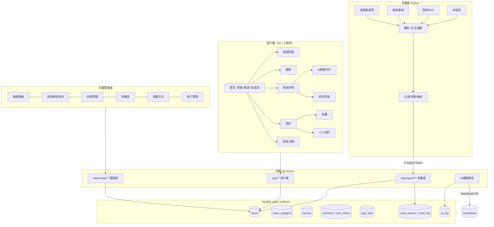

# 产品信息架构（思维导图版）

> 用法：把下面的缩进列表直接粘贴进 **XMind / ProcessOn / 幕布**，选择"文本导入 → 以缩进分级"，即可生成思维导图。
> 文末附 Mermaid 结构图（GitHub/Typora 可直接渲染）。

---

## 一、信息架构（可直接生成思维导图）

```
芜湖市科技创新新闻收集平台
├── 用户端（H5 / 微信小程序）
│   ├── 首页
│   │   ├── 顶部轮播 Banner（关联新闻，点击进详情）
│   │   ├── 频道切换（8 个：科技政策 / 创新平台 / 企业创新 / 成果转化 / 人才引育 / 园区动态 / 通知公告 / 他山之石）
│   │   ├── 信息流列表
│   │   │   ├── 标题 + 封面图
│   │   │   ├── AI 摘要前 40 字
│   │   │   ├── 来源 / 发布时间 / 阅读数
│   │   │   └── 上拉加载更多、下拉刷新
│   │   └── 搜索入口
│   ├── 频道列表页（按频道浏览）
│   ├── 搜索
│   │   ├── 关键词搜索（标题 / 关键词 / 来源 / 正文）
│   │   └── 结果列表（同信息流）
│   ├── 新闻详情
│   │   ├── 标题 / 来源 / 发布时间
│   │   ├── AI 摘要卡片（摘要 + 关键词标签 + "AI 生成，仅供参考"）
│   │   ├── 正文（富文本渲染）
│   │   ├── 查看原文（跳转 source_url）
│   │   ├── 点赞 / 收藏 / 分享
│   │   └── 评论区（发表评论、回复、评论点赞）
│   ├── 评论详情（回复列表分页）
│   ├── 我的
│   │   ├── 个人资料（昵称 / 手机号打码 / 注册状态）
│   │   ├── 我的收藏
│   │   ├── 修改密码
│   │   ├── 意见建议
│   │   ├── 关于本平台
│   │   └── 退出登录
│   └── 账号
│       ├── 登录（手机号 + 密码，无状态 JWT）
│       ├── 注册（手机号 + 昵称 + 密码，演示级免验证码）
│       └── 用户协议与隐私政策
├── 管理端（PC Web，内置静态页 /admin/index.html）
│   ├── 登录（管理员角色校验）
│   ├── 数据看板
│   │   ├── 新闻总数 / 待审 / 已发布 / 已驳回
│   │   ├── AI 已摘要 / AI 失败 / 今日新增
│   │   ├── 采集源数 / 用户数 / 评论数 / Banner 数 / 累计 token
│   │   └── 频道分布条形图
│   ├── 新闻管理
│   │   ├── 筛选：状态 / 频道 / AI 状态 / 关键词
│   │   ├── 列表分页
│   │   ├── 编辑（标题 / 频道 / 来源 / 封面 / 正文 / 轮播 / 状态）
│   │   ├── 审核（通过 / 驳回）
│   │   ├── 重新生成 AI 摘要 / 批量补齐摘要
│   │   └── 删除
│   ├── 轮播管理（新增 / 编辑 / 排序 / 上下线 / 删除）
│   ├── 采集源管理（adapter / 列表地址 / 默认频道 / 关键词过滤 / 翻页数 / 启停）
│   ├── 采集日志（抓取数 / 新增 / 重复 / 过滤 / 状态 / 耗时）
│   └── 用户管理（搜索 / 启用禁用）
├── 后端服务（api-server）
│   ├── 用户端接口 /api/**
│   │   ├── 内容：banner / getCategory / getIndex / detail
│   │   ├── 互动：comment / commentDetail / addComment / addReply / like / commentLike / favorite / favoriteList
│   │   └── 账号：login / register / userInfo / userIndex / updatePassword / logout / feedback
│   ├── 采集端接口 /api/ingest/**（X-Ingest-Token）
│   │   ├── sources（读取启用中的采集源）
│   │   ├── news（批量入库，source_url + 标题哈希双键幂等）
│   │   ├── log（采集日志回写）
│   │   └── source/{id}/touch（更新最近采集时间）
│   ├── 管理端接口 /admin/api/**（X-Admin-Token + role=1）
│   ├── AI 摘要服务（DeepSeek，异步 + 抽取式降级 + token 计量）
│   └── 定时/异步任务（aiExecutor 线程池）
├── 采集器（crawler，Python）
│   ├── 采集适配器
│   │   ├── wuhu_kjj_list（芜湖市科技局：工作动态 / 科技要闻 / 县区科技 / 通知公告）
│   │   ├── wuhu_gov_rss（芜湖市政府 RSS）
│   │   ├── wuhu_gov_list（芜湖市政府新闻中心）
│   │   └── wuhunews_list（芜湖新闻网：要闻 / 大江资讯）
│   ├── 处理流程
│   │   ├── 读取采集源配置（后端下发）
│   │   ├── 列表解析 → 标题 / 链接 / 时间
│   │   ├── 关键词过滤（可按源配置）
│   │   ├── 详情抓取 → 正文抽取（去导航/广告/页脚）+ 编码归一（UTF-8）
│   │   ├── 限速与重试（随机间隔 / 指数退避）
│   │   └── 推送入库 + 回写采集日志
│   └── 运行方式（命令行 / 定时任务）
└── 数据层（MySQL news_collector）
    ├── 内容：news / news_category / banner
    ├── 互动：comment / user_action
    ├── 用户：app_user
    └── 采集：crawl_source / crawl_log / ai_log
```

---

## 二、结构图（Mermaid）



---

## 三、关键页面流转

```
登录页 ──成功──► 首页 ──点击新闻──► 详情 ──查看原文──► 官方站点
  ▲                │                  │
  │                ├─切换频道─► 频道列表
  └──code=1000─────┤                  ├─点赞/收藏（未登录→登录页）
   （未登录拦截）   └─搜索────► 搜索结果
                                     └─评论──► 评论详情（回复分页）

管理端：登录 ──► 看板 ──► 新闻管理 ──审核/编辑──► 用户端可见
                     └──► 采集源 ──►（本地运行采集器）──► 采集日志
```
